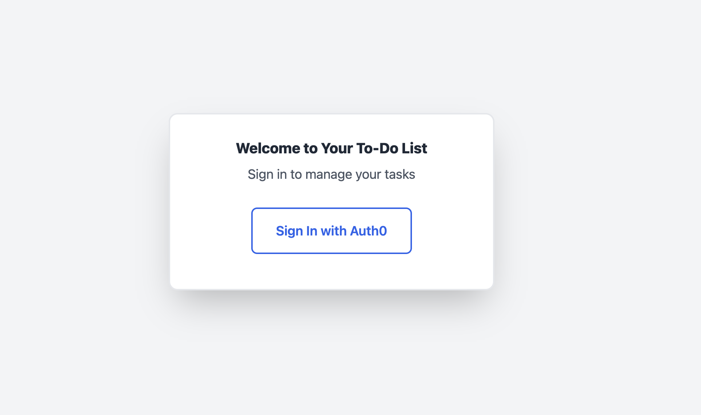
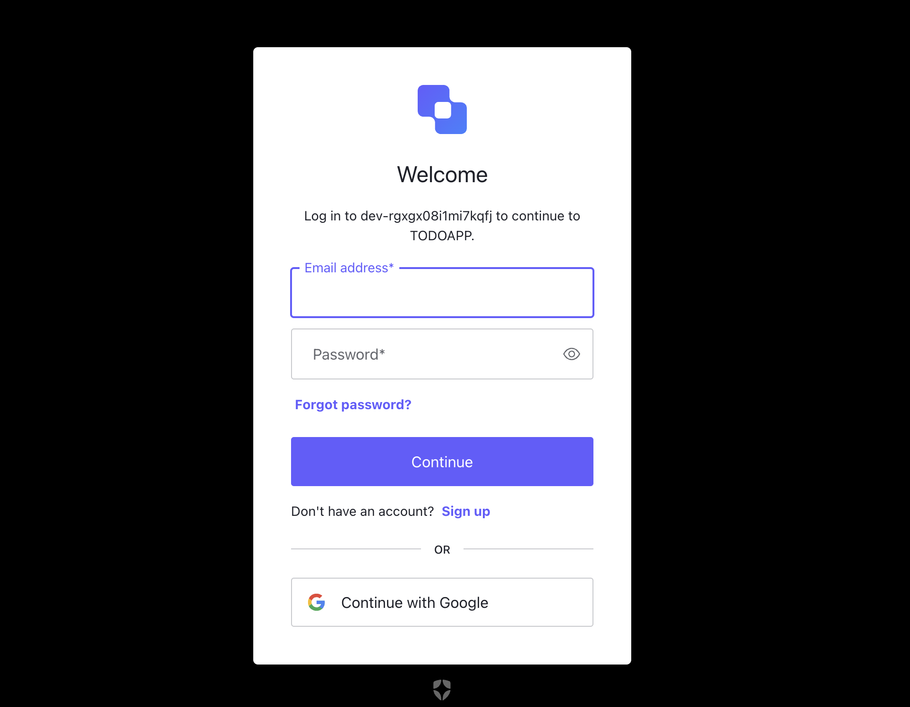
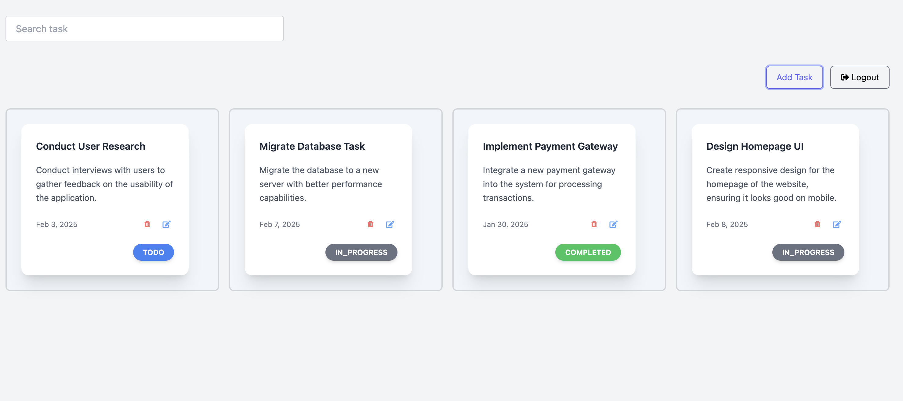
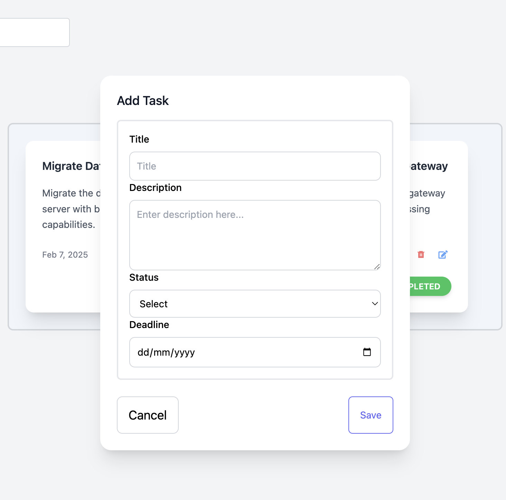
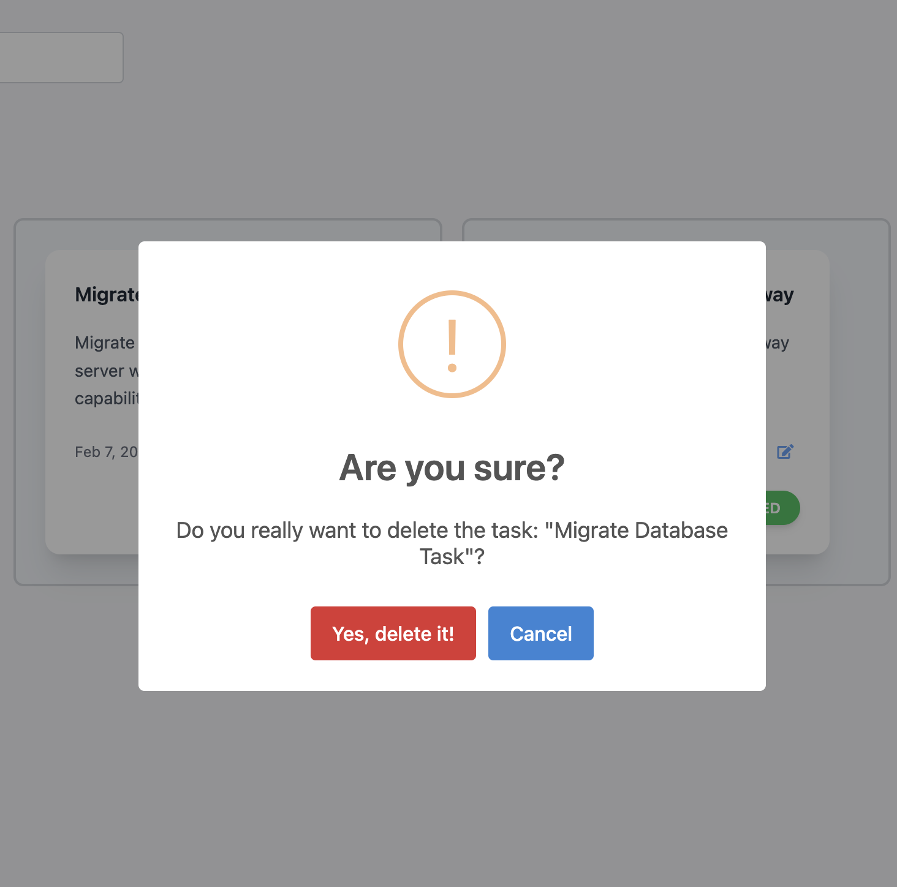

# Task manager

Task Manager is a simple web application for managing tasks efficiently. It allows users to create, edit, delete, and search for tasks. The project is built using:

- **Frontend:** React.js, Tailwind CSS, TypeScript  
- **Backend:** Express.js, PostgreSQL  
- **Authentication:** Auth0  

## Getting Started

Follow the steps below to set up and run the project locally.

### Clone the Repository

```bash
git clone https://github.com/parsimeikoikai/task-manager.git
cd task-manager
```
### Environment Variables
Before running the project, ensure you set up the following environment variables in the .env file inside the client folder:

```bash
VITE_AUTH0_DOMAIN=
VITE_AUTH0_CLIENT_ID=
VITE_AUTH0_REDIRECT_URI=
``` 

### Run Project Locally With Docker

To run the entire project with Docker, from the root of the project, execute:

```bash
docker-compose up --build
``` 
This command will:

- Build the Docker images for both the client and server.
- Set up and run the Postgres container.
- Apply any necessary Prisma migrations to the database.
- Start the client and server services.

Once everything is up and running, you can access:
- The client on http://localhost:5173
- The server on http://localhost:8080


### Run Test

To run tests for the client(UI) :

```bash
cd client
yarn test
``` 

### Endpoints Accessible from http://localhost:8080

#### Create Task

- **Endpoint**: [http://localhost:8080/api/v1/createTask](http://localhost:8080/api/v1/createTask)
- **Description**: Endpoint to create a new task.

#### Get All Tasks

- **Endpoint**: [http://localhost:8080/api/v1/getall](http://localhost:8080/api/v1/getall)
- **Description**: Endpoint to retrieve all tasks.

#### Delete Tasks

- **Endpoint**: [http://localhost:8080/api/v1/deleteTask/:id](http://localhost:8080/api/v1/deleteTask/:id)
- **Description**: Endpoint to delete  a Specific Task

### Screenshots









