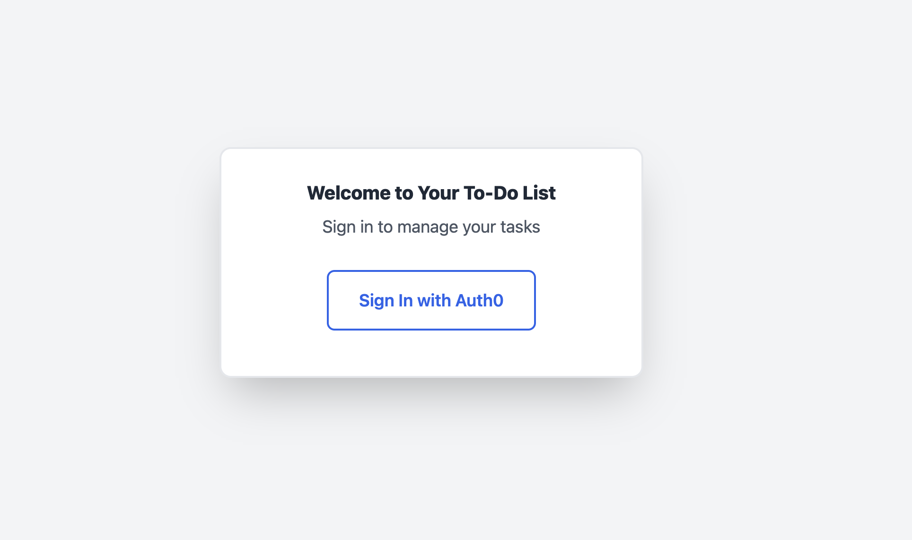
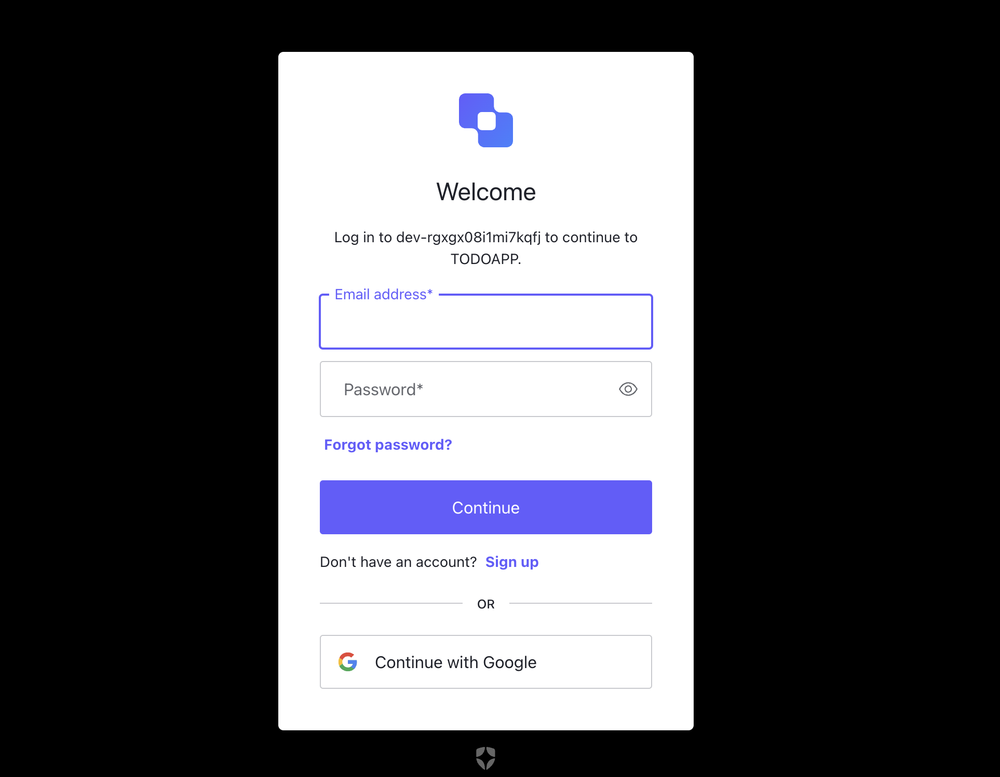
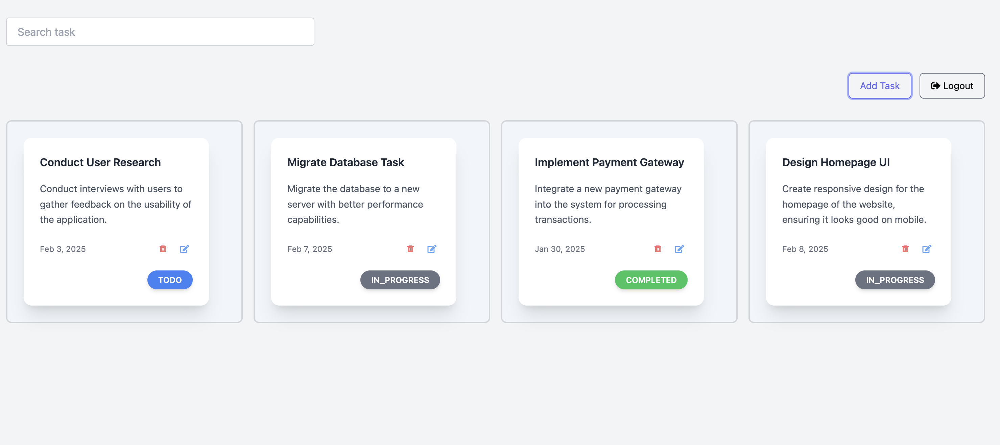
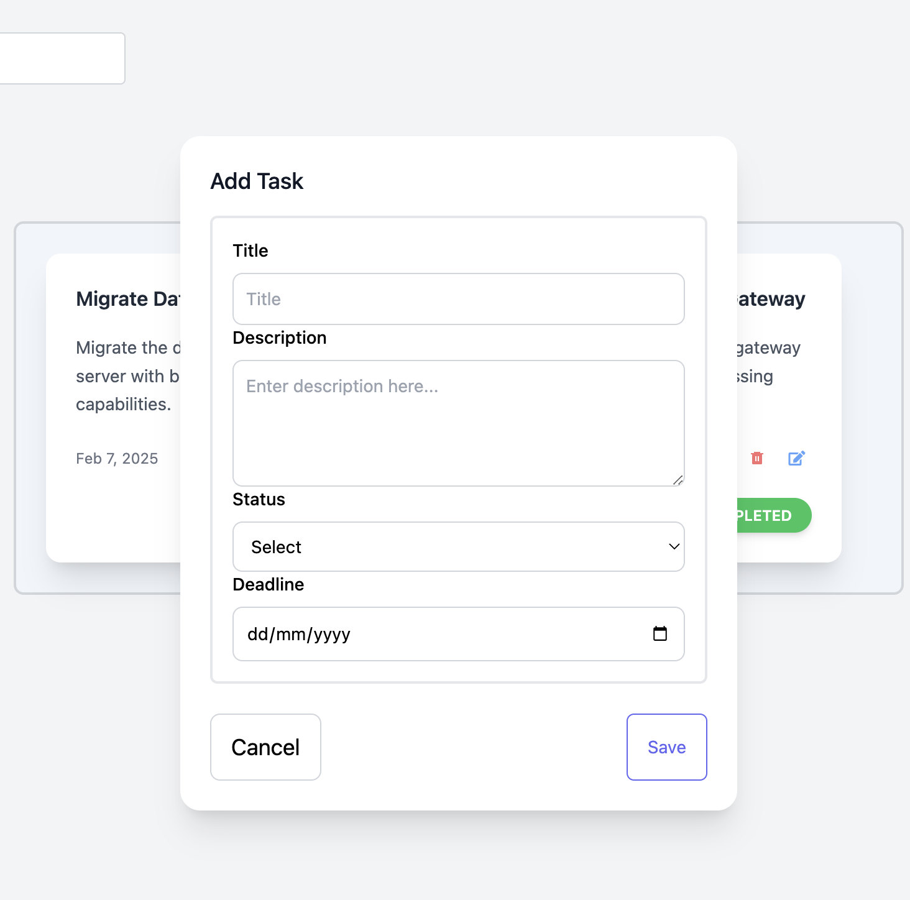

# Task manager


### Run Project Locally With Docker

To run the entire project with Docker, from the root of the project, run the following command:

```bash
docker-compose up --build
``` 

This command will:

- Build the Docker images for both the client and server.
- Set up and run the Postgres container.
- Apply any necessary Prisma migrations to the database.
- Start the client and server services.

Once everything is up and running, you can access:
- The client on http://localhost:5173
- The server on http://localhost:8080

### Endpoints Accessible from http://localhost:8080

#### Create Task

- **Endpoint**: [http://localhost:8080/api/v1/createTask](http://localhost:8080/api/v1/createTask)
- **Description**: Endpoint to create a new task.

#### Get All Tasks

- **Endpoint**: [http://localhost:8080/api/v1/getall](http://localhost:8080/api/v1/getall)
- **Description**: Endpoint to retrieve all tasks.

#### Delete Tasks

- **Endpoint**: [http://localhost:8080/api/v1/deleteTask/:id](http://localhost:8080/api/v1/deleteTask/:id)
- **Description**: Endpoint to delete  a Specific Task

### Screenshots









